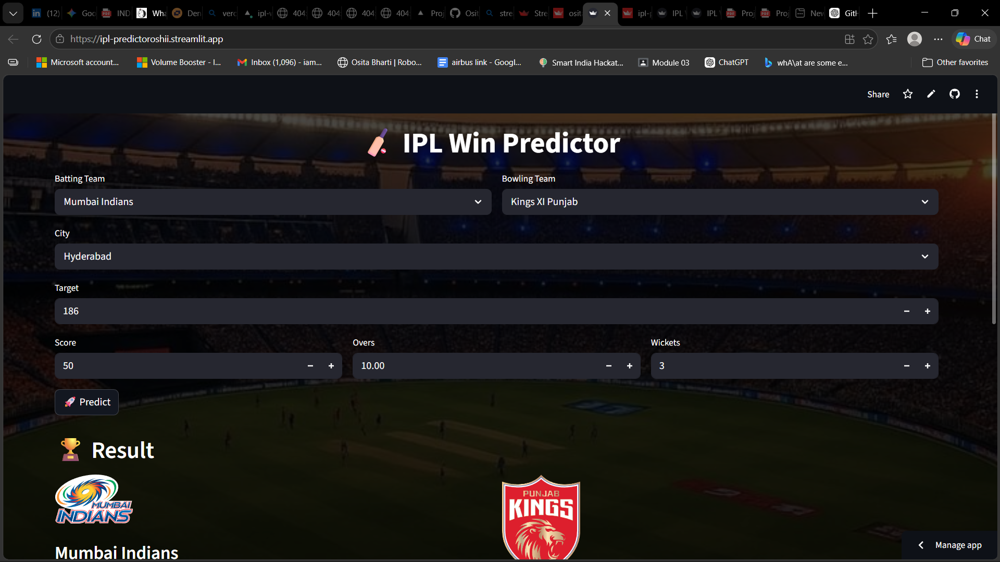

# 🏏 IPL Win Predictor

### 🎓 A Machine Learning Project | 🚀 Built with Data, Deployed with Style

<p align="center">
  
  
  
  <a href="https://ipl-predictoroshii.streamlit.app">
    
  </a>
</p>

---

## 🎯 Project Overview

This project was developed as part of our **Machine Learning coursework**, where we built a complete **end-to-end prediction system** for IPL match outcomes.

Instead of just training a model, we took it further —
-> cleaned real-world data
-> built a prediction pipeline
-> and deployed it as an interactive web app

 Because ML projects shouldn’t just stay in notebooks.

---
## 🖼️ Sneak Peek

<p align="center">
  
</p>

<p align="center">
  <i>Real-time IPL win probability prediction interface</i>
</p>

---

## ⚡ What Makes This Project Cool

✨ Real-time win probability prediction
📊 Uses actual IPL match data
🧠 End-to-end ML pipeline (not just a model)
🌐 Fully deployed web application
🎯 Built for both **learning + real-world usability**

---

## 🧠 How the Model Thinks

The prediction is based on match dynamics like:

* 🏏 Batting Team
* 🎯 Bowling Team
* 📍 City
* 🎯 Target
* 📊 Current Score
* ⏱️ Overs Completed
* ❌ Wickets Lost

It processes these inputs through a trained ML pipeline and outputs the **winning probability**.

---

## 🛠️ Tech Stack

| Area                | Tools Used   |
| ------------------- | ------------ |
| 💻 Interface        | Streamlit    |
| ⚙️ Backend          | Python       |
| 🤖 Machine Learning | Scikit-learn |
| 📊 Data Handling    | Pandas       |
| 💾 Model Storage    | Joblib       |

---

## 📂 Project Structure

```bash id="k4o2bn"
IPL/
│── app.py
│── train.py
│── data_cleaning.py
│── pipe.pkl
│── requirements.txt
│── deliveries.csv
│── matches.csv
│── assets/
│   └── app.png
```

---

## ⚙️ Run This Project Locally

```bash id="kgl8t6"
git clone https://github.com/your-username/IPL.git
cd IPL
pip install -r requirements.txt
streamlit run app.py
```

---

## 👥 Team

This project was built collaboratively as a group ML project 

* 👤 MAYANK KUMAR MISHRA
* 👤 OSITA BHARTI
* 👤 MAHIMA PATEL
* 👤 ARNAB MUKHAR BISWAS
* 👤 NIVED KUMAR

---

## 🚀 Learning Outcomes

Through this project, we learned:

✔ Data cleaning & preprocessing
✔ Feature engineering
✔ ML model building & evaluation
✔ Model deployment using Streamlit
✔ Working in a team on a real ML problem

---

## 🔮 Future Scope

* 📈 Player-level predictions
* 📊 Advanced visual analytics
* 🌐 API integration
* 🤖 More powerful models (XGBoost / DL)

---

## 💬 Final Note

This project reflects our journey from **learning ML concepts → applying them → deploying a real application**.

And honestly…
👉 this is just the beginning 🚀

---

## 📜 License

Open-source and free to use
